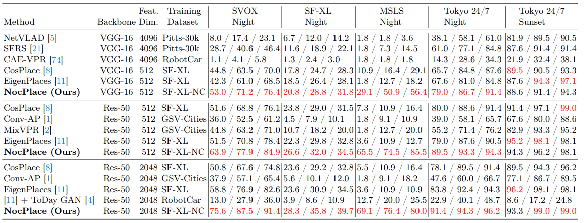
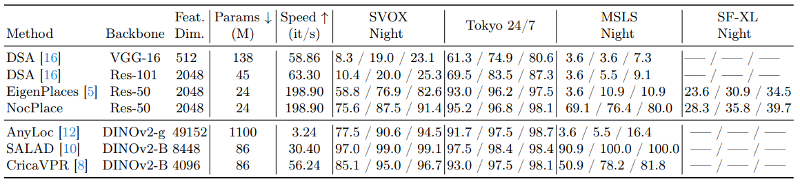

# NocPlace

This is the official pytorch implementation of the paper "NocPlace: Nocturnal Visual Place Recognition via Generative and Inherited Knowledge Transfer".
NocPlace can theoretically be extended to any VPR method and painlessly improve the recall in night scenes.

## Experimental results





## Test
```
python eval.py --backbone ResNet50 --fc_output_dim 512 --resume_model ResNet50_512_cosplace_noc.pth --test_set_folder ./datasets/tokyo247/images/test
```


## Acknowledgements

Parts of this repo are inspired by the following repositories:

* CosPlace
* EigenPlaces
* Deep-Visual-Geo-localization-Benchmark
