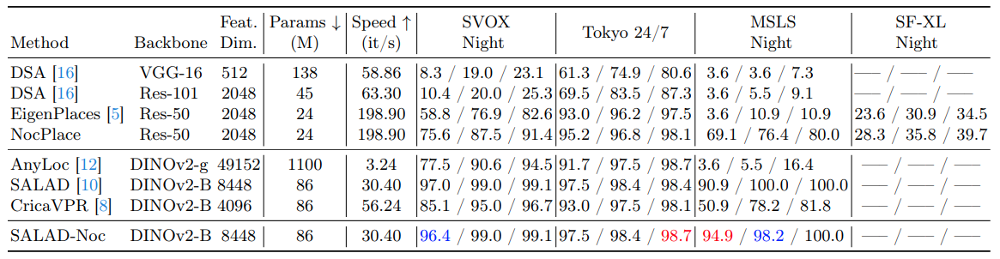

# NocPlace

This is the official pytorch implementation of the paper "NocPlace: Nocturnal Visual Place Recognition via Generative and Inherited Knowledge Transfer".
NocPlace can theoretically be extended to any VPR method and painlessly improve the recall in night scenes.

[arXiv](https://arxiv.org/abs/2402.17159)


## Experimental results




## Datasets

## Train

```
python train.py --groups_num 1 --backbone ResNet50 --fc_output_dim 512 --train_all_layers --lr 1e-6 --brightness 0 --contrast 0 --hue 0 --saturation 0 --resume_model ./ResNet50_512_cosplace.pth --train_set_folder ./train --val_set_folder ./val --use_ikt
```

## Test
```
python eval.py --backbone ResNet50 --fc_output_dim 512 --resume_model ResNet50_512_cosplace_noc.pth --test_set_folder ./datasets/tokyo247/images/test
```

## Acknowledgements

Parts of this repo are inspired by the following repositories:

* CosPlace (Mar 12, 2024)
* EigenPlaces
* Visual-Geo-localization-Benchmark
* SALAD
